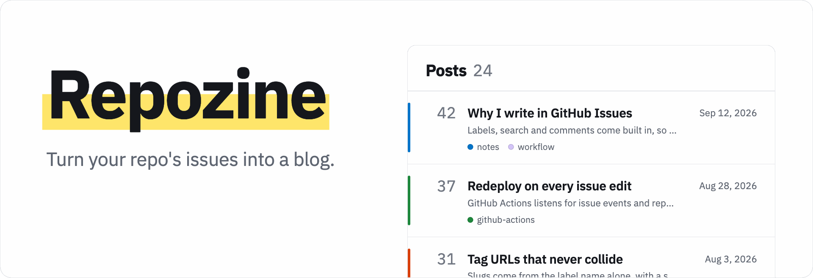

# Repozine

[![Deploy][deploy-shield]][deploy-url]
[![Contributors][contributors-shield]][contributors-url]
[![Forks][forks-shield]][forks-url]
[![Stargazers][stars-shield]][stars-url]
[![Issues][issues-shield]][issues-url]
[![MIT License][license-shield]][license-url]

<picture>
  <source media="(prefers-color-scheme: dark)" srcset=".github/assets/repozine-hero-dark.png" />
  
</picture>

---

Repozine turns a GitHub repository's Issues or Discussions into a static blog, built with Astro and deployed automatically to GitHub Pages.

# Live Demo

[https://zeikar.dev/repozine/](https://zeikar.dev/repozine/)

# How to use

## Use this template

[Use this template](https://github.com/zeikar/repozine/generate) to create a repository from this template.
[docs](https://docs.github.com/en/repositories/creating-and-managing-repositories/creating-a-repository-from-a-template#creating-a-repository-from-a-template)

```bash
vi config.json
```

Configure your `config.json` ([options](#configuration)) and commit it.

```bash
git add config.json
git commit -m "Configure Repozine"
git push origin main
```

Set the Pages source to **GitHub Actions** in your repository's Settings → Pages. [docs](https://docs.github.com/en/pages/getting-started-with-github-pages/configuring-a-publishing-source-for-your-github-pages-site)

Pushing to `main` triggers the deploy workflow, which builds the site and publishes it to GitHub Pages.

## Add Repozine to an existing repository

Repozine lives on its own `repozine` branch. Before pushing it for the first time, in your repository's Settings:

1. **Pages:** set the source to **GitHub Actions**. [docs](https://docs.github.com/en/pages/getting-started-with-github-pages/configuring-a-publishing-source-for-your-github-pages-site)
2. **Environments → github-pages:** add `repozine` to the deployment branches, since the switch above allows only the default branch.
3. **Secrets and variables → Actions → Variables:** set `REPOZINE_REF` to `repozine`.

```bash
git remote add repozine https://github.com/zeikar/repozine
git fetch repozine
git checkout -f -b repozine repozine/main
vi config.json   # see Configuration below
git commit -am "Configure Repozine"
git push origin repozine   # deploys the site
```

To also rebuild when posts or comments change, copy `.github/workflows/deploy.yml` unchanged to your default branch: issue and discussion events only run workflows from there, and `REPOZINE_REF` makes that copy build the `repozine` branch.

## Switch from issues to discussions

GitHub has no API or bulk action for this, so convert each post with **Convert to discussion** on its issue page, into the category you publish. The discussion keeps the title, body, author, labels and date but gets a new number, so the post's URL changes; the issue is left closed and locked. Then set `source` to `"discussions"` and `discussionCategory` in `config.json`.

## Configuration

| Key                  | Description                                                                                                                                                       |
| -------------------- | ----------------------------------------------------------------------------------------------------------------------------------------------------------------- |
| `websiteTitle`       | Title shown in the navbar, footer and browser tab                                                                                                                 |
| `repoOwner`          | Owner of the repository. Only issues or discussions authored by this account are published, so the repository must be owned by a user, not an organization        |
| `repoName`           | Repository whose issues or discussions become posts                                                                                                               |
| `source`             | `"issues"` or `"discussions"`                                                                                                                                     |
| `discussionCategory` | Discussion category **slug** to publish from. Required when `source` is `"discussions"`. Use an Announcement-format category so only maintainers can create posts |
| `googleAnalyticsId`  | Google Analytics measurement ID (e.g. `G-XXXXXXXXXX`). Leave empty to disable analytics                                                                           |
| `language`           | Language of the posts as a tag such as `"en"` or `"ko"`, used for `<html lang>`. Include a region (`"ko-KR"`) to also set `og:locale`. Defaults to `"en"`         |

## Comments

- `source: "issues"` uses [utterances](https://utteranc.es/), bound to the issue number. Install the [utterances GitHub App](https://github.com/apps/utterances) on the repository.
- `source: "discussions"` uses [giscus](https://giscus.app/), bound to the discussion number. Install the [giscus GitHub App](https://github.com/apps/giscus) on the repository and enable Discussions.

## Search engines

- Every page gets Open Graph / Twitter card tags and, when the repository's About text or the owner's bio provides one, a description. Every page except search and 404 (both `noindex`) gets a canonical URL. Posts add their dates and labels as article metadata and schema.org `BlogPosting` data.
- A post's link preview shows its first image. Posts without one get a card rendered by [DOGimg](https://dogimg.vercel.app).
- `sitemap.xml` and `rss.xml` are built next to the home page, e.g. `https://<owner>.github.io/<repo>/sitemap.xml`.
- Crawlers read `robots.txt` only at the root of a host, so a site gets one only when it is served from there: a `<owner>.github.io` repository, or a project repository with its own domain. For a project site under a path, add `Sitemap: https://<host>/<repo>/sitemap.xml` to the root site's `robots.txt`, or submit the sitemap in Google Search Console.
- The deploy workflow passes the site's real address to the build, so absolute URLs and links follow a custom domain, including one set on the repository itself. Local builds assume `https://<owner>.github.io/<repo>/` unless `SITE_URL` is set, e.g. `SITE_URL=https://blog.example.com`.

## Local development

Posts are fetched from the GitHub GraphQL API at build time, so `npm run dev`, `npm run build` and `npm run check` all need a `GITHUB_TOKEN`.

```bash
npm install
GITHUB_TOKEN=$(gh auth token) npm run dev
```

Search is powered by a [Pagefind](https://pagefind.app/) index generated by `npm run build`, so it only works on a built site:

```bash
GITHUB_TOKEN=$(gh auth token) npm run build && npm run preview
```

# Known limitations

- A closed discussion is removed from the site only on the next build, because GitHub Actions has no discussion closed/reopened trigger.
- Without JavaScript, dates are shown in UTC; otherwise they are shown in the reader's time zone.
- Discussion comment counts include top-level comments only.

# Sites using Repozine

- [https://zeikar.dev/leetcode/](https://zeikar.dev/leetcode/)
- [and many more...](https://github.com/topics/repozine)

# License

Distributed under the MIT License. See `LICENSE` for more information.

<!-- MARKDOWN LINKS & IMAGES -->
<!-- https://www.markdownguide.org/basic-syntax/#reference-style-links -->

[deploy-shield]: https://github.com/zeikar/repozine/actions/workflows/deploy.yml/badge.svg
[deploy-url]: https://github.com/zeikar/repozine/actions/workflows/deploy.yml
[contributors-shield]: https://img.shields.io/github/contributors/zeikar/repozine.svg
[contributors-url]: https://github.com/zeikar/repozine/graphs/contributors
[forks-shield]: https://img.shields.io/github/forks/zeikar/repozine.svg
[forks-url]: https://github.com/zeikar/repozine/network/members
[stars-shield]: https://img.shields.io/github/stars/zeikar/repozine.svg
[stars-url]: https://github.com/zeikar/repozine/stargazers
[issues-shield]: https://img.shields.io/github/issues/zeikar/repozine.svg
[issues-url]: https://github.com/zeikar/repozine/issues
[license-shield]: https://img.shields.io/github/license/zeikar/repozine.svg
[license-url]: https://github.com/zeikar/repozine/blob/main/LICENSE.txt
